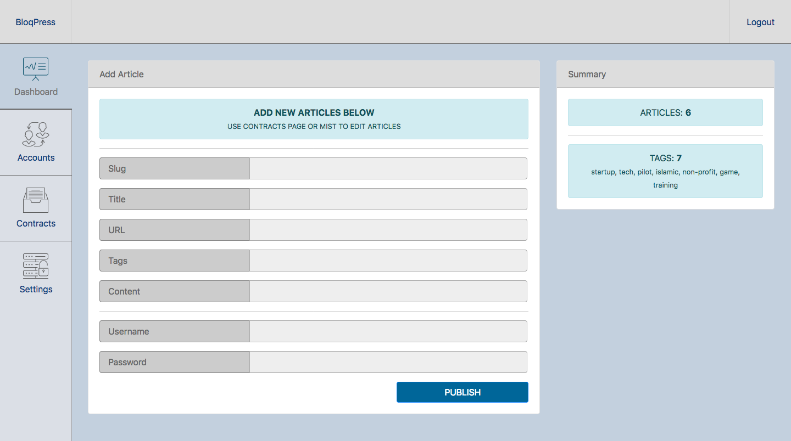

```

-----------------------------------------------------------------------
    PLEASE NOTE THAT THIS IS ONLY A PRE-ALPHA PROOF OF CONCEPT ONLY
-----------------------------------------------------------------------

```

### bloq.press #### - smart contract based cms

There is no documentation currently available.

All configuration options are available within `admin/secrets.js`.

The online demo is set to use the [Neuroware](http://neuroware.io) private network.

These settings need to be changd within the `admin/secrets.js` file, or:

* Send us an [email](mailto:founders@r1.my) and ask for some private ether
* Deploy your own contracts on your own network or the public network

Documentation is in process. In the meantime, please see the following screenshots:

Articles:


Login:


Dashboard:



#### Credits

Maintained by [R1](http://r1.my) under MIT [LICENSE](LICENSE.md)